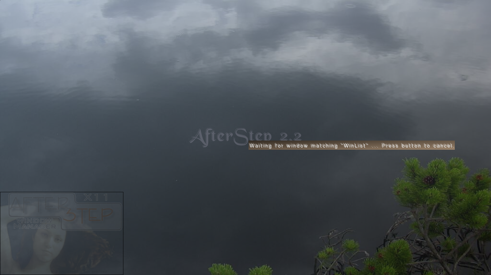
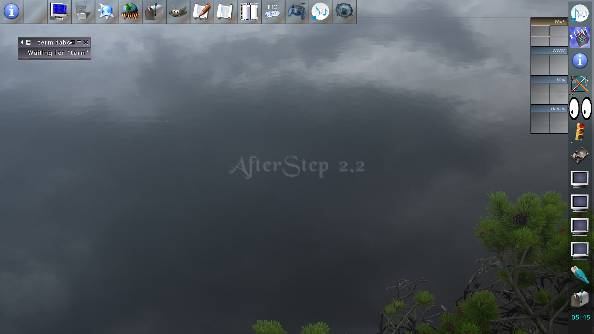
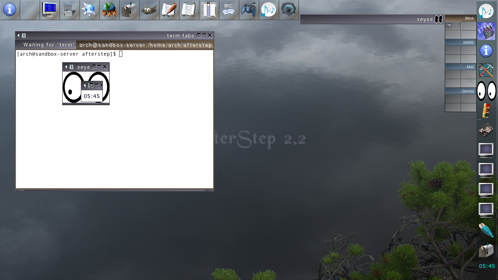
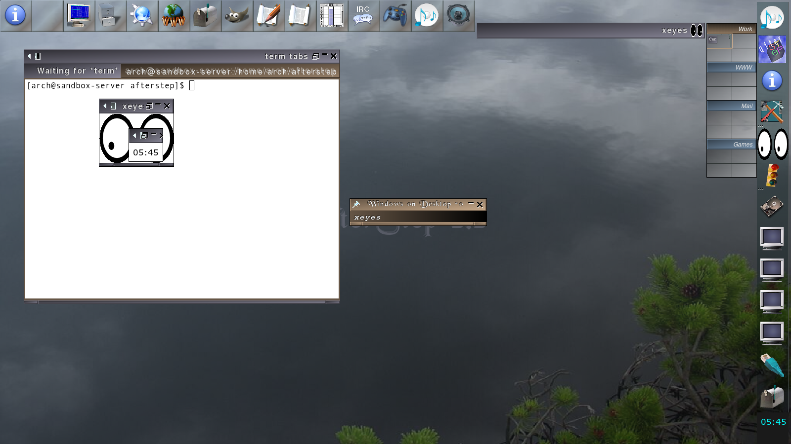

# AfterStep

AfterStep is a highly configurable X11 window manager inspired by NeXTSTEP.

This repository contains the AfterStep 2.x codebase plus updates to build and run on modern
Linux/Xorg systems.

## Screenshots (2026-01-18, Xvfb)

<p>
  
  
</p>
<p>
  
  
</p>

Full in-repo gallery: [screenshots/2026-01-18-xvfb/index.html](screenshots/2026-01-18-xvfb/index.html)

## Build + install (local prefix)

```sh
make distclean
./configure --prefix="$PWD/_install"
make -j"$(nproc)"
make install install.data
```

## Headless smoke tests (optional)

```sh
tools/xvfb-smoke.sh
tools/xvfb-full-smoke.sh
tools/xvfb-soak.sh _install 60
```

Optional:

- Xephyr-based RandR smoke test: `tools/xephyr-randr-smoke.sh`
- Headless Xorg dummy driver smoke test: `tools/xorg-dummy-smoke.sh` (requires `sudo`)

## Running AfterStep

- `startx` / `xinit`: put `exec /path/to/_install/bin/afterstep` in `~/.xinitrc`
- Display managers: install `AfterStep.desktop` / `AfterStep.session` into your system’s `xsessions`
  directory (location varies by distro/prefix)

## Notes

- Wharf/MonitorWharf buttons may be disabled if the configured applications aren’t installed.
- Set `TERMINAL` to choose the terminal emulator used by terminal-launch actions.

## More

- Historical upstream README (kept for context): [README](README)
