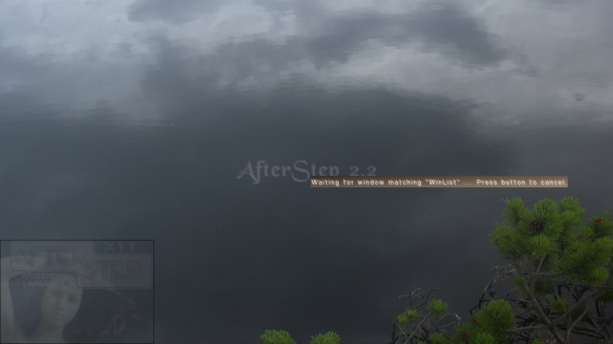
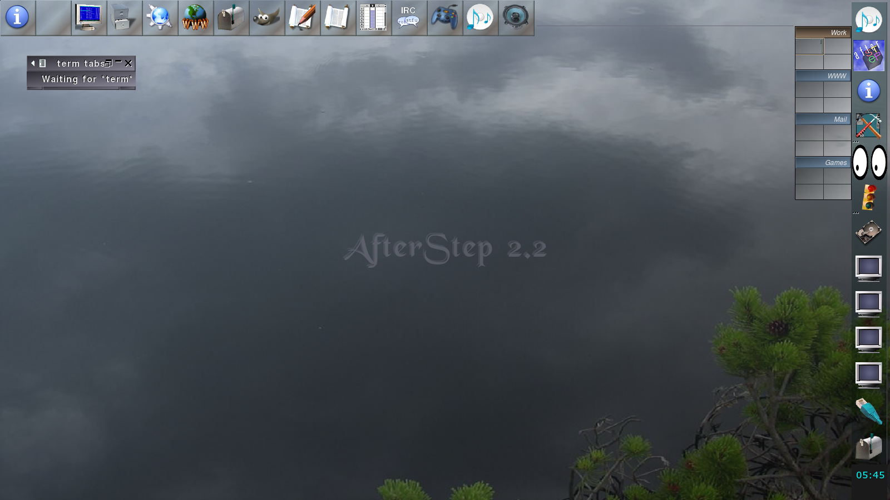
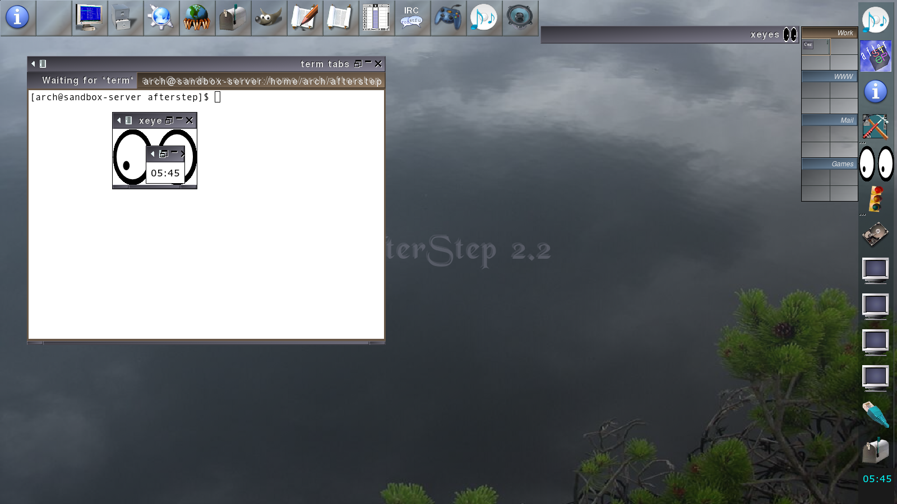
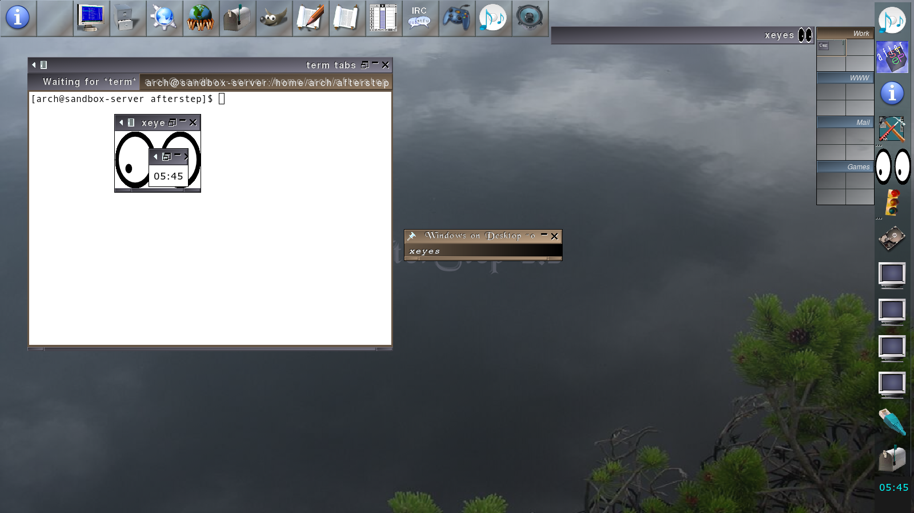
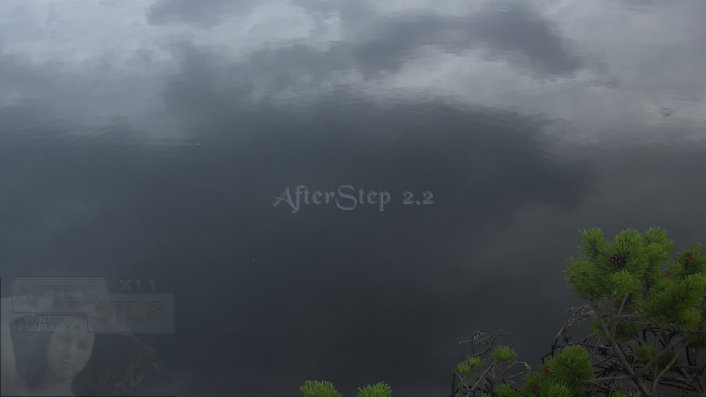
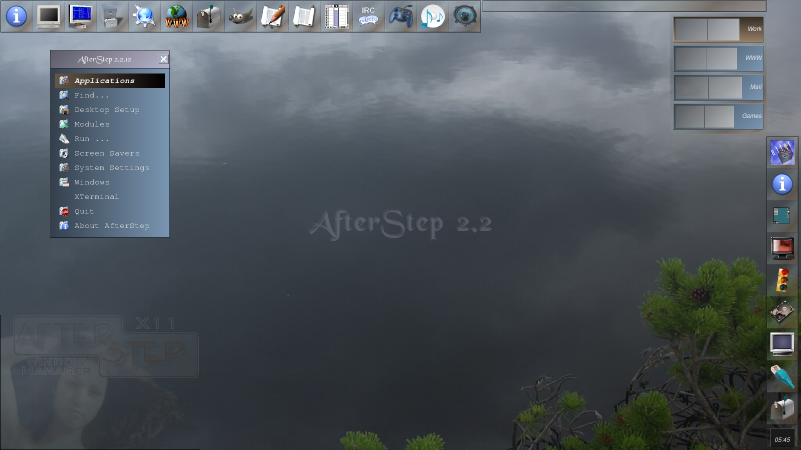
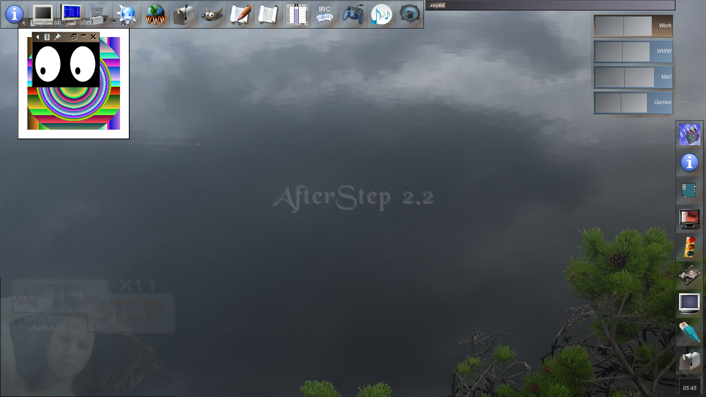
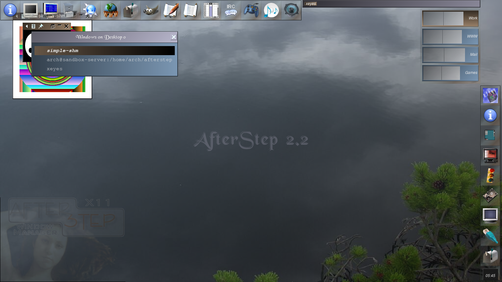
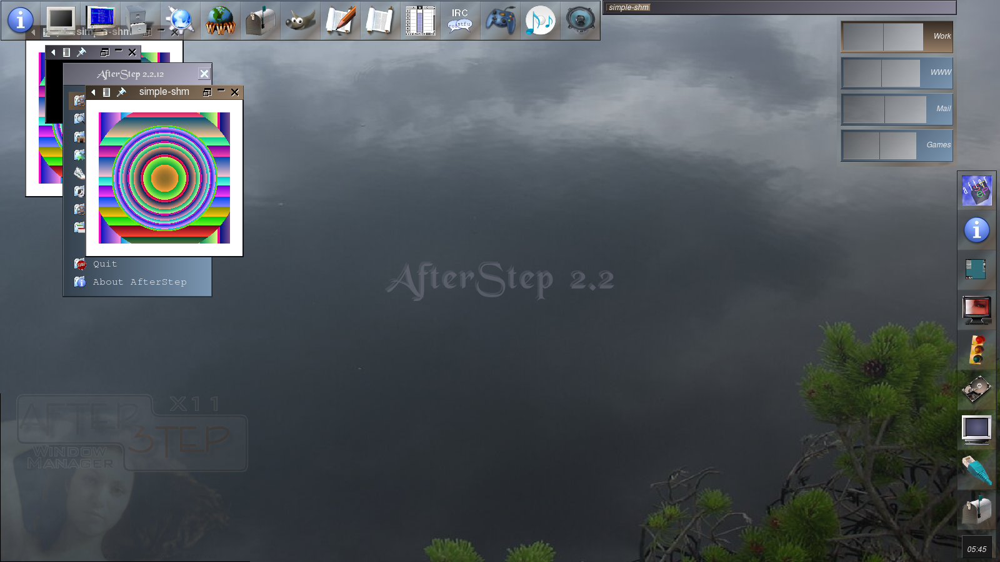
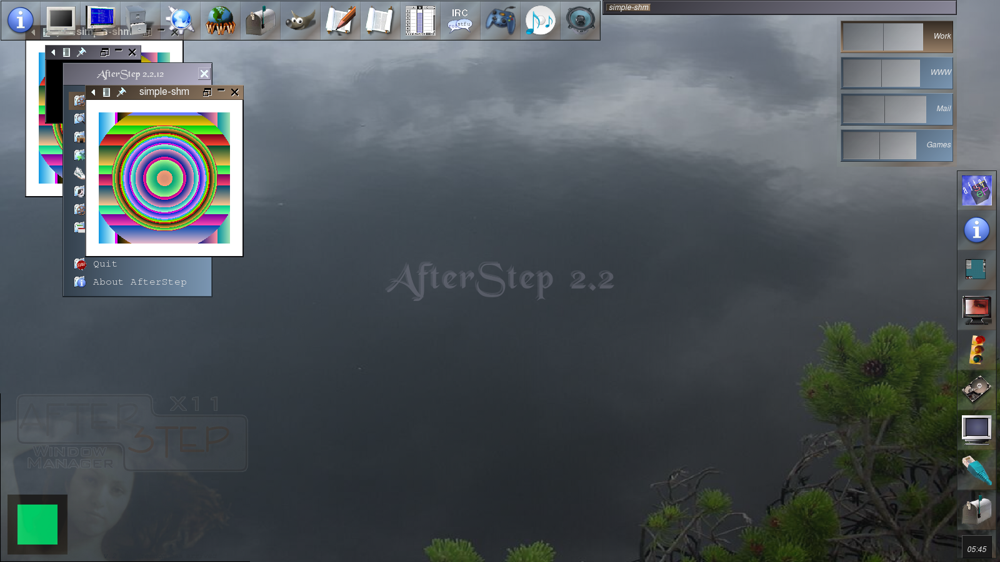

# AfterStep

AfterStep is a highly configurable X11 window manager inspired by NeXTSTEP.

This repository contains the AfterStep 2.x codebase plus updates to build and run on modern
Linux/Xorg systems.

## Screenshots (2026-01-18, Xvfb)

<p>
  
  
</p>
<p>
  
  
</p>

Full in-repo gallery: [screenshots/2026-01-18-xvfb/index.html](screenshots/2026-01-18-xvfb/index.html)

## Screenshots (2026-02-05, Wayland/aswlcomp)

<p>
  
  
</p>
<p>
  
  
</p>
<p>
  
  
</p>

Full in-repo gallery: [screenshots/2026-02-05-wayland/index.html](screenshots/2026-02-05-wayland/index.html)

## Build + install (local prefix)

```sh
make distclean
./configure --prefix="$PWD/_install"
make -j"$(nproc)"
make install install.data
```

## Headless smoke tests (optional)

```sh
tools/xvfb-smoke.sh
tools/xvfb-full-smoke.sh
tools/xvfb-soak.sh _install 60
```

Optional:

- Xephyr-based RandR smoke test: `tools/xephyr-randr-smoke.sh`
- Headless Xorg dummy driver smoke test: `tools/xorg-dummy-smoke.sh` (requires `sudo`)

## Running AfterStep

- `startx` / `xinit`: put `exec /path/to/_install/bin/afterstep` in `~/.xinitrc`
- Display managers: install `AfterStep.desktop` / `AfterStep.session` into your system’s `xsessions`
  directory (location varies by distro/prefix)

## Wayland status (experimental)

AfterStep itself is still an **X11 window manager**. Native Wayland support is being approached in two tracks:

- **Wayland clients (“B track”)** in `wayland/` (e.g. a panel/launcher that runs as a normal Wayland client).
- **Compositor work (“C track”)** via a wlroots-based compositor scaffold.

Quick start:

```sh
make -C wayland
./wayland/aswlpanel
./wayland/aswlmenu
```

Optional compositor scaffold (requires `wlroots` development files on your system):

```sh
make -C wayland aswlcomp
```

Wayland session packaging (display managers):

```sh
make install.wayland
```

This installs a `wayland-sessions` entry (`AfterStep-Wayland.desktop`) plus a small wrapper
(`afterstep-wayland-session`) that prefers user configs in `~/.config/afterstep/` and falls back to
system defaults in `$prefix/share/afterstep/wayland/`.

Nested Wayland dev run (from an existing Wayland session):

```sh
WLR_BACKENDS=wayland ./wayland/aswlcomp --socket aswlcomp-0 --spawn "./wayland/aswlpanel"
```

Convenience target (auto-selects `WLR_BACKENDS=wayland` or `x11` and uses a temporary autostart file):

```sh
make -C wayland run-nested
```

Tips:

- `Alt+Escape` exits `aswlcomp`
- `Alt+LMB` moves windows, `Alt+RMB` resizes windows
- Workspace switching (configurable): `bind Alt+1 workspace 1`, `bind Alt+Right workspace_next`, etc.
- Panel config: `~/.config/afterstep/aswlpanel.conf` (or `ASWLPANEL_CONFIG`); supports `@workspaces` (auto workspace buttons), `@workspace N` actions, and `Label|ICON=command` buttons (ICON can be a path, an AfterStep icon spec like `normal/Document` / `Text.xpm`, or an XDG icon name like `firefox`).
- Menu/launcher: `aswlmenu` (config: `~/.config/afterstep/aswlmenu.conf` or `ASWLMENU_CONFIG`; supports `@menu NAME`/`@endmenu` sections with `@submenu [NAME]` entries, plus `Label|ICON=command` items. `.desktop` apps may be auto-added via `@desktop_entries` (default unless `@no_desktop_entries`), and their `Icon=` names are resolved via XDG icon themes and `/usr/share/pixmaps` (PNG only). Optional override: `ASWL_ICON_THEME`.)
- Theme colors/fonts: `aswlpanel`/`aswlmenu` will try to read AfterStep’s current look/colorscheme from `~/.afterstep/non-configurable/0_look` and `~/.afterstep/non-configurable/0_colorscheme` (or `/usr/share/afterstep/non-configurable/*`). Optional overrides: `~/.config/afterstep/aswltheme.conf` or `ASWLTHEME_CONFIG` (keys: `LookPath=...`, `ColorSchemePath=...`, `PanelStyle=...`, `MenuItemStyle=...`, `MenuHiliteStyle=...`, `MenuTitleStyle=...`). If built with FreeType+fontconfig, they also attempt to use `Font` from the selected `MyStyle` (overrides: `ASWL_FONT`, `ASWLPANEL_FONT`, `ASWLMENU_FONT`; set to `builtin`/`5x7` to force the embedded font).
- `--spawn` may be repeated to launch multiple clients
- Optional autostart file: `~/.config/afterstep/aswlcomp.autostart` (one command per line, optional `exec ` prefix; also supports `bind MODS+KEY exec CMD`)
- If Xwayland is available, `aswlcomp` sets `DISPLAY` (printed at startup) so it can run legacy X11 apps under Wayland.

## Notes

- Wharf/MonitorWharf buttons may be disabled if the configured applications aren’t installed.
- Set `TERMINAL` to choose the terminal emulator used by terminal-launch actions.

## More

- Historical upstream README (kept for context): [README](README)
